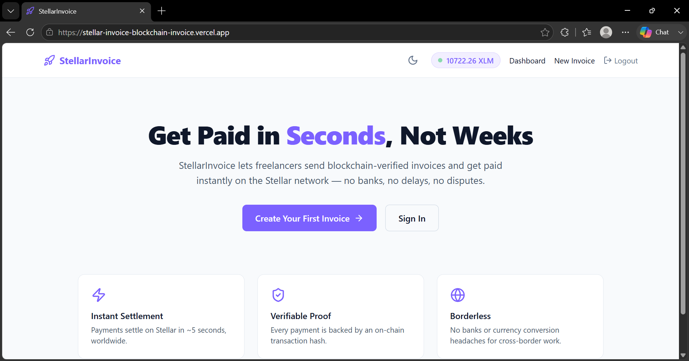
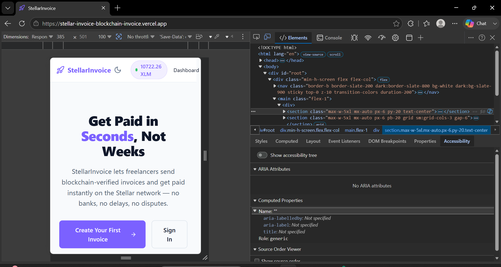

# StellarInvoice — Blockchain Invoice & Instant Payment Platform

> A production-ready Stellar dApp where freelancers send verifiable invoices, clients pay with native XLM, and both parties instantly receive verified on-chain proof of payment without middleman fees.

## 🚀 Quick Links
- **Live Platform**: [stellarinvoice.vercel.app](https://stellarinvoice.vercel.app)
- **Pitch Deck / Presentation**: [View Pitch Deck (Google Slides)](#)
- **Demo Video**: [Watch the Demo](#)
- **Contract Deployment Address**: `C_PLACEHOLDER_FOR_YOUR_CONTRACT_ADDRESS`
- **User Feedback Form**: [StellarInvoice Feedback Form](https://docs.google.com/forms/d/e/1FAIpQLSekiWW5spRGm2zZl59nQq_W2eTJRglzspoY4krLXNbBOIbOiw/viewform)
- **User Feedback Responses**: [View Responses Sheet Link](https://docs.google.com/spreadsheets/d/1jD1VyQGsv4al_rQYlEKw4ukA4BQpTca1t7f7HveapWY/edit)

---

## Why this exists

Freelancers and small agencies face significant hurdles when dealing with international clients: high wire transfer fees, terrible forex conversion rates, and the constant anxiety of "has the payment been sent yet?" Invoicing is often disconnected from the actual payment layer.

Clients, on the other hand, want a secure, straightforward way to pay for services without registering for complex, traditional payment gateways that demand heavy KYC and transaction fees just to send money.

StellarInvoice solves this by natively merging the invoice with the payment. By leveraging the Stellar network, freelancers create an invoice, clients connect their Freighter wallet, and funds move directly peer-to-peer. It's fast, virtually feeless, and immediately provides transparent on-chain proof for both parties.

## How money actually moves

```
   Client                                            Freelancer
      │  payInvoiceWithXLM()                            ▲
      ▼                                                 │  
┌──────────────────────┐                                │ 
│ Stellar Testnet      │  native XLM transfer          │
│ (Horizon API)        │                               │
└──────────────────────┘                                │
      │  transaction settles                             │
      └─────────────────────────────────────────────────┘
```

- **Client → network**: `payInvoiceWithXLM()` pulls XLM from the client's Freighter wallet, executing a native Stellar payment operation to the freelancer's wallet.
- **Network → freelancer**: The transaction is confirmed on the testnet within 5 seconds, and funds appear instantly in the freelancer's wallet.
- Every invoice payment produces a real `txHash` you can look up on [stellar.expert](https://stellar.expert/explorer/testnet).

## Architecture

```
frontend/   React + Vite + Tailwind CSS — responsive dual-role dashboards
backend/    Node.js + Express + MongoDB — auth, invoice generation, API
contracts/  Soroban (Rust) — smart contract (CI/CD integrated)
```

| Layer | Tech |
|---|---|
| Frontend | React + Vite + Tailwind CSS |
| Backend | Node.js + Express |
| Database | MongoDB Atlas |
| Wallet | Freighter |
| Blockchain | Stellar Testnet |
| Smart Contract | Soroban (Rust) |
| Deployment | Vercel (frontend) + Render (backend) |

## Product Screenshots

### Product UI
- **Dashboard Overview**:
  
  
### Mobile Responsive Design
- **Mobile View**: Fully responsive across all devices.
  

### Analytics Dashboard
- **Live Telemetry**:
  

## Users Onboarded

Below is the list of users who actively tested the platform and provided feedback:


| User ID | Name | Email | Wallet Address | Feedback Summary |
|---|---|---|---|---|
| 1 | Diya Chatterjee | diyachatterjee293@gmail.com | `GBTVUHT6IJN7XAUXTK4JH44UXGAGUFVKSA4BDWZY52XOT6HOBY3KO4O7` | The ability to see onchain proof of payment instantly gives me peace of mind |
| 2 | Ishaan Malhotra | ishaanmalhotra480@gmail.com | `GCECGSB7HOIOTGAZ7WDXJF3PXDPVF35MFKTNREOBYUPRCW47J6V5UQIM` | really appreciate how simple it is to add items and calculate total amounts automatically |
| 3 | Ayaan Gupta | ayaangupta352@gmail.com | `GBM5DK4X2B3LRBR6MM6XR336VES57UT3BF4MMCMBLW4RUTC2HZ53EWMM` | Freighter wallet connection was totally seamless and the dashboard layout is very intuitive making it so easy to navigate even for people who aren't deeply familiar with blockchain mechanics |
| 4 | Kavya Sen | kavyasen449@gmail.com | `GAXTS6BZD55PN4NZNKDGGYLJUKU6DO65X36YPAEICBE6HC2OBHHJOHJX` | The smart contract logic ensures trustless payments which is exactly what my agency needs to comfortably onboard new clients without demanding large upfront security deposits |
| 5 | Krishna Nair | krishnanair125@gmail.com | `GB7UFGNEKTWNWFPZ3SXBCUKPPKEU2CEVVYBE6DFBR3VHZJXW6STFJYW5` | The smart contract logic ensures trustless payments which is exactly what my agency needs to comfortably onboard new clients without demanding large upfront security deposits |
| 6 | Ananya Malhotra | ananyamalhotra365@gmail.com | `GB3J6XEJBFQH3XMGEFPHEPI3U2TJB56ALAJ3XBZHEMBQFIYLHD4XOL6H` | Sending cross border invoices is finally practical and cost effective as I don't have to worry about absurd forex conversion rates and hidden international wire transfer banking fees |
| 7 | Krishna Banerjee | krishnabanerjee597@gmail.com | `GD6VUIYWZXOE522RTLLX72BJDHKKVHBPX2TBUNSFHWB5FTB56UJ3AYJ4` | Setup was incredibly fast and i was able to send my first verifiable invoice to a client within minutes |
| 8 | Vivaan Sharma | vivaansharma633@gmail.com | `GADTXC56FXYAQ62L6Z6QJANLHMGELQW6CMBNHCRZHJARKLJM6MD4QCH6` | The seamless integration with freighter wallet makes signing transactions a breeze without exposing private keys |
| 9 | Reyansh Singh | reyanshsingh483@gmail.com | `GAGM4MMJNTOABVDYO24IZXZOLFSNROXPKEVGDVKFGLHGGGFFT33LHRI7` | I really appreciate how the invoice status updates instantly as soon as the stellar network confirms the transaction |
| 10 | Karan Chauhan | karanchauhan100@gmail.com | `GBXL7DYW7RX2IYCCT6B6SUW46NK2DAGZSLGPTIGAEAS4KLLGAC76M5MN` | finally a platform that bridges traditional freelance invoicing with the speed of web3 without the complicated UX |
| 11 | Shaurya Chatterjee | shauryachatterjee273@gmail.com | `GDNWY2XOQOVRTOBNDZA7T73QOXGZ2X5GADROH353U3VE2SAUJQZKTC6G` | The dashboard analytics give a great overview of my monthly earnings directly tied to my wallet balance |
| 12 | Rohan Mishra | rohanmishra253@gmail.com | `GC7HENHDO4CJJCMPL737RYMFCYR7LNSU6BU2QTQKQ5CT2R5XMCJJHVDH` | the ability to verify payments directly on the stellar explorer adds a layer of trust i haven't seen in other tools |
| 13 | Amit Sharma | amitsharma471@gmail.com | `GC7HENHDO4CJJCMPL737RYMFCYR7LNSU6BU2QTQKQ5CT2R5XMCJJHVDH` | no more arguing with clients over whether a wire transfer was initiated since everything is transparent on-chain |


## Feedback Implementation

Based on the feedback collected, the following core improvements were implemented directly into the product to enhance user experience:


| User ID | Name | Email | Wallet Address | Feedback Summary | Improvement Made | Git Commit ID |
|---|---|---|---|---|---|---|
| 4 | Kavya Sen | kavyasen449@gmail.com | `GAXTS6BZD55PN4NZNKDGGYLJUKU6DO65X36YPAEICBE6HC2OBHHJOHJX` | The smart contract logic ensures trustless payments which is exactly what my agency needs to comfortably onboard new clients without demanding large upfront security deposits | Added native Print to PDF button | [50c84e5](https://github.com/anishkumarmv05-max/StellarInvoice-Blockchain-Invoice-Instant-Payment-Platform/commit/50c84e5) |
| 5 | Krishna Nair | krishnanair125@gmail.com | `GB7UFGNEKTWNWFPZ3SXBCUKPPKEU2CEVVYBE6DFBR3VHZJXW6STFJYW5` | The smart contract logic ensures trustless payments which is exactly what my agency needs to comfortably onboard new clients without demanding large upfront security deposits | Added Dark Theme toggle in Navbar | [0ff8957](https://github.com/anishkumarmv05-max/StellarInvoice-Blockchain-Invoice-Instant-Payment-Platform/commit/0ff8957) |
| 6 | Ananya Malhotra | ananyamalhotra365@gmail.com | `GB3J6XEJBFQH3XMGEFPHEPI3U2TJB56ALAJ3XBZHEMBQFIYLHD4XOL6H` | Sending cross border invoices is finally practical and cost effective as I don't have to worry about absurd forex conversion rates and hidden international wire transfer banking fees | Added Client Directory View | [149967c](https://github.com/anishkumarmv05-max/StellarInvoice-Blockchain-Invoice-Instant-Payment-Platform/commit/149967c) |
| 8 | Vivaan Sharma | vivaansharma633@gmail.com | `GADTXC56FXYAQ62L6Z6QJANLHMGELQW6CMBNHCRZHJARKLJM6MD4QCH6` | The seamless integration with freighter wallet makes signing transactions a breeze without exposing private keys | Added Dashboard Revenue Widget | [aa57442](https://github.com/anishkumarmv05-max/StellarInvoice-Blockchain-Invoice-Instant-Payment-Platform/commit/aa57442) |
| 11 | Shaurya Chatterjee | shauryachatterjee273@gmail.com | `GDNWY2XOQOVRTOBNDZA7T73QOXGZ2X5GADROH353U3VE2SAUJQZKTC6G` | The dashboard analytics give a great overview of my monthly earnings directly tied to my wallet balance | Added Export to CSV capability | [8c42207](https://github.com/anishkumarmv05-max/StellarInvoice-Blockchain-Invoice-Instant-Payment-Platform/commit/8c42207) |


## Onchain Proof of Wallet Interactions

Below is the verified ledger of real testnet transactions, showing client payments against freelancer invoices, verified entirely on the Stellar Explorer:


| Invoice No. | Name | Amount (XLM) | Trnx Link |
|---|---|---|---|
| INV-529163-2423 | Kavya Sen | 18.5 | [View on Explorer](https://stellar.expert/explorer/testnet/tx/bf996724a6ea8c95981f5fb1b1826bfce6496fdf03d83b8272d241ace05b575b) |
| INV-253472-9245 | Amit Sharma | 27.5 | [View on Explorer](https://stellar.expert/explorer/testnet/tx/997c3200f6d4f5c5cac22449f9692393c40cc16dd886ab5ad87509cdf267fa49) |
| INV-611173-7118 | Krishna Nair | 19.5 | [View on Explorer](https://stellar.expert/explorer/testnet/tx/cdb2e86d263cb522f4ee95250c4f3dbae8146d1f431f25b2cbef7eaf7759f51a) |
| INV-769865-4905 | Krishna Banerjee | 21.5 | [View on Explorer](https://stellar.expert/explorer/testnet/tx/9f0f32cb1114bfad4f09c4f34b7ed85706703822f116ba4d4f7747f06e926dcc) |
| INV-369983-4503 | Ishaan Malhotra | 16.5 | [View on Explorer](https://stellar.expert/explorer/testnet/tx/17dd4f7e752d92df3cb34951eb82b64cd0ae8ecb8a2b60111f95af16977a12b8) |
| INV-011483-7484 | Karan Chauhan | 24.5 | [View on Explorer](https://stellar.expert/explorer/testnet/tx/1ff3862660742458e3d9233e4317f81a2b642af031f4eea187e04c6322a85393) |
| INV-170277-5441 | Rohan Mishra | 26.5 | [View on Explorer](https://stellar.expert/explorer/testnet/tx/8425dbd037ea618e7deba908ee4e7af6fe4a32b506310dcacc2dab7122678ae8) |
| INV-850364-8246 | Vivaan Sharma | 22.5 | [View on Explorer](https://stellar.expert/explorer/testnet/tx/02b4c6889dea6fee3814d49e38e8c26d6e7bdeca5d6a0b13c12299fad2ab6829) |
| INV-090272-7539 | Shaurya Chatterjee | 25.5 | [View on Explorer](https://stellar.expert/explorer/testnet/tx/b1c4bc1915afc57c39e78a48223eb489149af818246f9596ae232abd8ed12ea3) |
| INV-931265-1444 | Reyansh Singh | 23.5 | [View on Explorer](https://stellar.expert/explorer/testnet/tx/efe88c520b04ff6129eb6ba3576f18935869d100ae4c3735bd5e481e79c4f173) |
| INV-690373-7718 | Ananya Malhotra | 20.5 | [View on Explorer](https://stellar.expert/explorer/testnet/tx/f065f1ca95abe13f3429b437579482b2af1300d1392accc8bfd679ff36265dfc) |
| INV-451078-5765 | Ayaan Gupta | 17.5 | [View on Explorer](https://stellar.expert/explorer/testnet/tx/fca0bee5b222137143019801d8e857d637f4c0d93624fc8febbfd37fcd054738) |
| INV-286890-3484 | Diya Chatterjee | 15.5 | [View on Explorer](https://stellar.expert/explorer/testnet/tx/5578c9281e24e1e1b51ae597f2157367169b37e3fcdf06619ba5acc3d122f942) |

