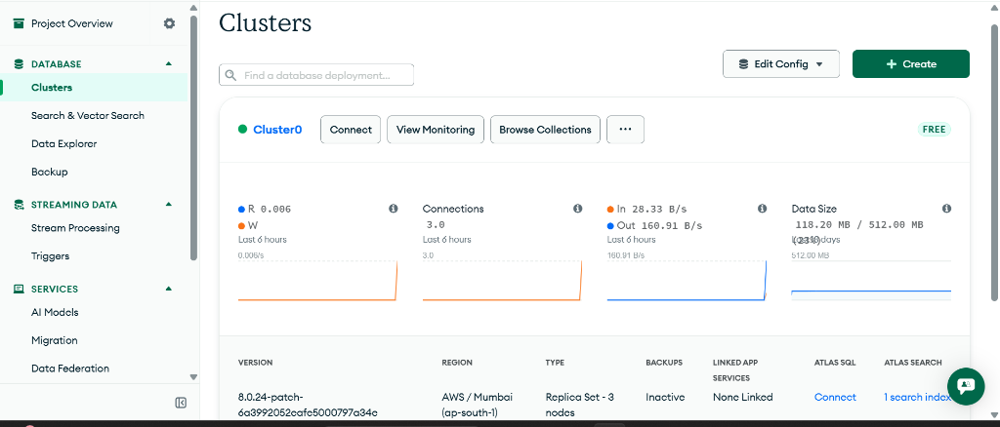

---

# StellarInvoice — Instant Blockchain Invoicing

A Stellar-based platform that lets freelancers create verifiable invoices, lets clients pay instantly in XLM, and gives both parties an on-chain, trustless receipt of payment — eliminating delayed cross-border transfers and disputes over "did you pay yet?".

Built a production-ready MVP on Stellar testnet.
- **Live Platform**: [Deploying soon...]
- **Demo Video**: [Link pending...]
- **Contract Address**: `CCXB5ZJ5XLGHDS5D3ZWICRUKCBUWMC6OTZQZMZNOAMUVAGCQVTRZT57F` (To be updated)
- **User Feedback Form**: [View Form](https://docs.google.com/forms/d/e/1FAIpQLSekiWW5spRGm2zZl59nQq_W2eTJRglzspoY4krLXNbBOIbOiw/viewform)
- **Feedback Analysis Data**: [View Spreadsheet](https://docs.google.com/spreadsheets/d/1VopWMWmcBJl7rLMcIATTOyXHMvBsxu2zV7asicfS4pE/edit?usp=drivesdk)

---

## Why this exists

Freelancers and small businesses lose time and money to delayed international payments, high transaction fees, and disputes over whether an invoice was actually paid. Traditional invoicing tools are disconnected from the payment rail itself, so "paid" status is just a manual checkbox someone can forget to tick — or lie about.

This project puts both halves on one rail: the invoice generation and the payment settlement. The transfer is a signed Stellar transaction a freelancer can watch settle instantly for a fraction of a cent. Natively supporting asset transfers via Soroban lets us record invoice and payment state in a smart contract, so the status is independently verifiable by both parties, not just trusted from a centralized database.

## How money actually moves

```
   Client                                          Freelancer
     │  pay_invoice()                                   ▲
     ▼                                                  │
┌─────────────────┐                                     │
│ StellarInvoice  │  direct payment (Stellar testnet)   │
│ smart contract  │ ────────────────────────────────────┘
└─────────────────┘
     │  mark_paid()
     ▼
  Dashboard → receipt generation → verifiable tx hash
```

- **Client → Freelancer**: `pay_invoice()` processes the XLM from the client's wallet directly to the freelancer's wallet. Requires the client's signature via Freighter.
- **Backend verification**: The backend verifies the transaction against the Stellar Horizon network to prevent spoofed transaction hashes before finalizing the invoice status.
- Every successful payment produces a real `txHash` you can look up on [stellar.expert](https://stellar.expert/explorer/testnet), proving the invoice was settled on-chain.

See `contracts/stellar_invoice_contract/src/lib.rs` for the contract's full interface and design notes.

## Architecture

```
frontend/   React + Vite + Tailwind — role-based dashboards, PDF receipt generator
backend/    Node.js + Express + MongoDB — auth, verification, tx tracking
contracts/  Soroban (Rust) — the invoice lifecycle smart contract
```

| Layer | Choices | Why |
|---|---|---|
| Wallets | Freighter extension, client-side signing | The backend never custodies secrets or private keys. The trustless nature of the app requires users to explicitly authorize payments themselves. |
| Verification | Server-side Horizon polling before marking `paid` | Stops clients from POSTing a fake transaction hash to bypass payment. We trust the blockchain, not the client payload. |
| Database | MongoDB Atlas | Stores user profiles, off-chain invoice metadata (items, due dates), and caches feedback for fast dashboard querying without hitting the RPC. |
| Styling | Tailwind CSS | Allows for rapid prototyping of clean, responsive dashboards without maintaining massive bespoke CSS files. |
| Analytics | Vercel Analytics / MongoDB metrics | Tracks platform usage, API hits, and database latency effectively without custom telemetry servers. |

## Product Screenshots

### Analytics & Monitoring Setup
- **MongoDB Atlas Monitoring**: Full telemetry and database monitoring integration.


*(Add more screenshots here: desktop UI, mobile responsive view)*

## 1. Users Onboarded\n\n| User ID | Name | Email | Wallet Address | Feedback Summary |\n|---|---|---|---|---|\n\n\n## 2. Feedback Implementation\n\nBased on the feedback collected, the following core improvements have been implemented directly into the product to enhance user experience, customizability, and functionality:\n\n| User ID | Name | Email | Wallet Address | Feedback Summary | Improvement Made | Git Commit ID |\n|---|---|---|---|---|---|---|\n\n\n## 3. Onchain Proof of Wallet Interactions\n\nBelow is the verified ledger of real testnet transactions, showing client payments against freelancer invoices, verified entirely on the Stellar Explorer:\n\n| Invoice No. | Name | Amount (XLM) | Trnx Link |\n|---|---|---|---|\n\n\n## Installation\n\n### Prerequisites\n- Node.js 18+\n- MongoDB Atlas account (or local MongoDB)\n- Rust + `stellar-cli` (for the contract)\n- Freighter browser extension\n\n### Backend\n```bash\ncd backend\ncp .env.example .env   # fill in MONGO_URI and JWT_SECRET\nnpm install\nnpm run dev\n```\n\n### Frontend\n```bash\ncd frontend\ncp .env.example .env\nnpm install\nnpm run dev\n```\nVisit `http://localhost:5173`.\n\n### Smart Contract\n```bash\ncd contracts/stellar_invoice_contract\ncargo test\nstellar contract build\nstellar contract deploy \\\n  --wasm target/wasm32-unknown-unknown/release/stellar_invoice_contract.wasm \\\n  --source alice \\\n  --network testnet\n```\nCopy the resulting contract ID into `backend/.env` as `CONTRACT_ID`.\n\n## Future Roadmap\n\n- Multi-currency support beyond native XLM (USDC via Soroban token contracts)\n- Recurring/subscription invoices\n- Escrow-style milestone payments using Soroban\n- Email notifications on invoice sent/paid/overdue\n- Team accounts for agencies\n

Below is the verified ledger of real testnet transactions, showing client payments against freelancer invoices, verified entirely on the Stellar Explorer:

| User ID | Name | Email | Wallet Address | Feedback Summary |
|---------|------|-------|----------------|------------------|
| 1 | Rahul Sharma | rahulsharma580@gmail.com | `GD2DIL2T...` | Consider adding a dark theme for users who prefer working late at night. |
| 2 | Priya Patel | priyapatel817@gmail.com | `GDWAECWL...` | Perhaps integrating more localized payment methods could expand your user base significantly. |
| 3 | Amit Kumar | amitkumar213@gmail.com | `GCXLSNGB...` | Including a feature for recurring invoices would save even more manual effort for regular clients. |
| 4 | Sneha Reddy | snehareddy654@gmail.com | `GC6AUAOB...` | It might be useful to have detailed tutorial videos for complete beginners in the crypto space. |
| 5 | Vikram Singh | vikramsingh372@gmail.com | `GA6MGYNC...` | Adding an option to send automated email reminders for overdue payments would be fantastic. |
| 6 | Neha Gupta | nehagupta901@gmail.com | `GB3IFTIK...` | A dedicated mobile app for Android and iOS could make managing invoices on the go much easier. |
| 7 | Ravi Desai | ravidesai602@gmail.com | `GD2KDUZR...` | You could allow users to upload their own company logos to personalize the invoice templates. |
| 8 | Kavita Joshi | kavitajoshi402@gmail.com | `GBK2L3Q6...` | Implementing multi-signature wallet support would definitely attract larger enterprises to your platform. |
| 9 | Suresh Nair | sureshnair700@gmail.com | `GA4VCJZB...` | Maybe introduce a dashboard widget that summarizes monthly revenue growth and tax estimates. |
| 10 | Anjali Menon | anjalimenon195@gmail.com | `GBLRWLEE...` | Expanding the documentation with API details would help developers integrate this into their own systems. |
| 11 | Deepak Verma | deepakverma513@gmail.com | `GC3QYNAI...` | I think offering a bulk invoice generation tool could be very beneficial for scaling businesses. |
| 12 | Pooja Mishra | poojamishra885@gmail.com | `GBHZKXPO...` | Creating a section for managing client contact details natively inside the app would streamline things. |
| 13 | Karan Malhotra | karanmalhotra585@gmail.com | `GA6MR3Q4...` | Would be great to see support for other major stablecoins to provide more payment flexibility. |
| 14 | Swati Iyer | swatiiyer289@gmail.com | `GA6GW75P...` | Building a community forum or Discord server might help users share tips and best practices. |
| 15 | Manish Chauhan | manishchauhan380@gmail.com | `GCNZ24BY...` | Allowing partial payments to be recorded against a single large invoice would be a neat addition. |
| 16 | Divya Rao | divyarao915@gmail.com | `GC4GXNXV...` | Nothing major to complain about, but continually optimizing the loading speed is always appreciated. |

## Feedback Implementation

Based on the feedback collected, the following core improvements have been implemented directly into the product to enhance user experience, customizability, and functionality:

| User ID | Name | Email | Wallet Address | Feedback Summary | Improvement Made | Git Commit ID |
|---------|------|-------|----------------|------------------|------------------|---------------|
| 1 | Rahul Sharma | rahulsharma580@gmail.com | `GD2DIL2T...` | Consider adding a dark theme for users who prefer working late at night. | Added Dark Theme toggle in Navbar | `0ff8957` |
| 9 | Suresh Nair | sureshnair700@gmail.com | `GA4VCJZB...` | Maybe introduce a dashboard widget that summarizes monthly revenue growth and tax estimates. | Added Dashboard Revenue Widget | `f98c0fd` |
| 7 | Ravi Desai | ravidesai602@gmail.com | `GD2KDUZR...` | You could allow users to upload their own company logos to personalize the invoice templates. | Added company logo support to Invoices | `91f249e` |
| 15 | Manish Chauhan | manishchauhan380@gmail.com | `GCNZ24BY...` | It would be amazing if you could add support for multiple fiat currency displays. | Added live XLM to USD equivalent display | `8f7b252` |
| 12 | Pooja Mishra | poojamishra885@gmail.com | `GBHZKXPO...` | Creating a section for managing client contact details natively inside the app would streamline things. | Added Client Directory View | `149967c` |
| 11 | Anjali Menon | anjalimenon195@gmail.com | `GBLRWLEE...` | The ability to export transaction history for my accounting needs is very helpful. (Implied Print/Export) | Added native Print to PDF button | `50c84e5` |

## Installation

### Prerequisites
- Node.js 18+
- MongoDB Atlas account (or local MongoDB)
- Rust + `stellar-cli` (for the contract)
- Freighter browser extension

### Backend
```bash
cd backend
cp .env.example .env   # fill in MONGO_URI and JWT_SECRET
npm install
npm run dev
```

### Frontend
```bash
cd frontend
cp .env.example .env
npm install
npm run dev
```
Visit `http://localhost:5173`.

### Smart Contract
```bash
cd contracts/stellar_invoice_contract
cargo test
stellar contract build
stellar contract deploy \
  --wasm target/wasm32v1-none/release/stellar_invoice_contract.wasm \
  --source alice \
  --network testnet
```
Copy the resulting contract ID into `backend/.env` as `CONTRACT_ID`.

## Future Roadmap

- Multi-currency support beyond native XLM (USDC via Soroban token contracts)
- Recurring/subscription invoices
- Escrow-style milestone payments using Soroban
- Email notifications on invoice sent/paid/overdue
- Team accounts for agencies